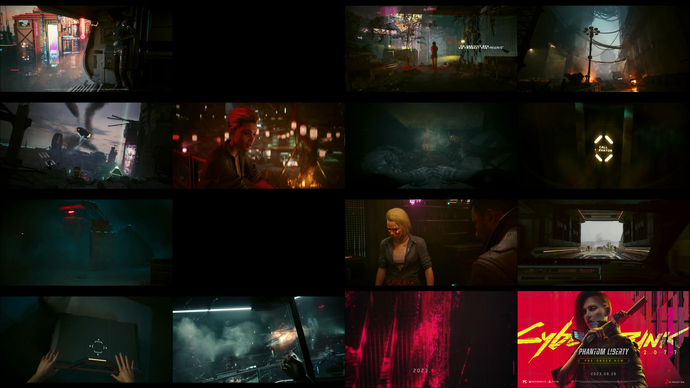

# previewer
Creates preview image from a video

# Prerequisites
* Rust build toolchain (on the build machine)
* FFmpeg

# How to use
```Usage:
  ./target/release/previewer [OPTIONS]


Optional arguments:
  -h,--help             Show this help message and exit
  -i,--input INPUT      Input video path.
  -s,--scaling SCALING  Scaling factor (default: 1, which combines all images
                        without scaling. Set it below 1 to downscale.).
  -b,--border BORDER    Border size (default: 6 px).
  -o,--output OUTPUT    Output image path (default: preview.jpg).
  -c,--count COUNT      Image count in the preview (default: 16).
```

# How to install
Make sure your `.cargo/bin` folder is added to your PATH.

`cargo install --path .`
then run using

previewer [opts]

# Caveats
* Border size is relative to the video resolution, so it may appear differently depending on which video you generate previews for.

# Example
Generating preview for this video [Cyberpunk 2077: Phantom Liberty — Official Trailer](https://www.youtube.com/watch?v=reABCMNGM3w) with these arguments: 
`previewer -i video.webm -s 0.1` produces this image:

Note that some black frames are expected because this video has transitions.
